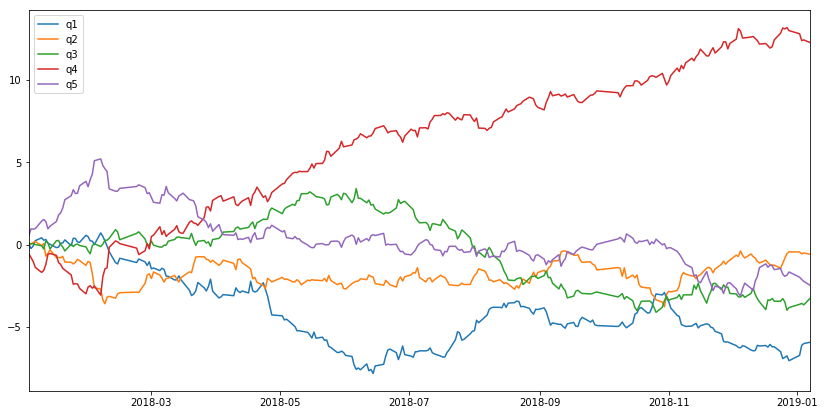
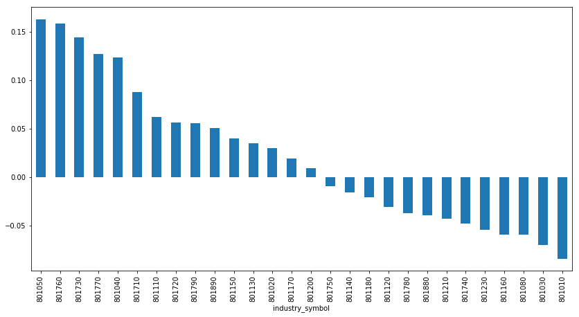
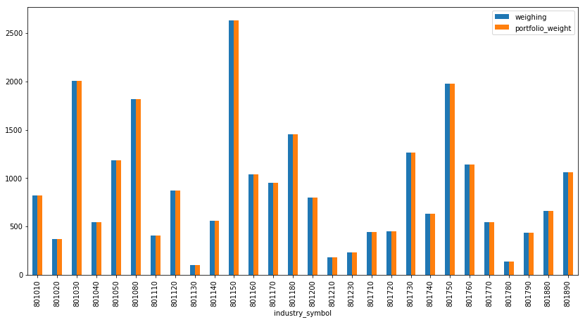

```python
%matplotlib inline
from vision.api import *
from alphamind.api import *
from alphamind.portfolio.linearbuilder import linear_builder
import pandas as pd
import numpy as np
```

## 获取中证500的成分股


```python
%%time
q = query(Index.isymbol, Index.trade_date,Index.iname,
         Index.symbol,Index.sname,Index.weighing).filter(
    Index.trade_date < '2019-01-08', Index.trade_date > '2018-01-01', Index.isymbol=='000905.XSHG')
index_df = get_fundamentals(q)
index_df = index_df.rename(columns={'iname':'index_name','isymbol':'index_symbol'})
```

    CPU times: user 2.19 s, sys: 298 ms, total: 2.49 s
    Wall time: 5.01 s


## 获取现金流表因子数据


```python
%%time
q = query(CashFlow.symbol, CashFlow.trade_date, CashFlow.net_operate_cash_flow,
         CashFlow.net_invest_cash_flow, CashFlow.net_finance_cash_flow).filter(
    CashFlow.trade_date < '2019-01-08', CashFlow.trade_date > '2017-01-01',
    CashFlow.symbol.in_ (list(set(index_df.symbol))))
cash_flow = get_fundamentals(q)
```

    CPU times: user 4.36 s, sys: 573 ms, total: 4.93 s
    Wall time: 5.46 s


## 获取申万一级行业


```python
%%time
industry_set = ['801010', '801020', '801030', '801040', '801050', '801080', '801110', '801120', '801130', 
                  '801140', '801150', '801160', '801170', '801180', '801200', '801210', '801230', '801710',
                  '801720', '801730', '801740', '801750', '801760', '801770', '801780', '801790', '801880','801890']
q = query(Industry.isymbol, Industry.trade_date,Industry.iname,
         Industry.symbol).filter(
    Industry.trade_date < '2019-01-08', Industry.trade_date > '2017-01-01', Industry.isymbol.in_ (industry_set),
                Industry.symbol.in_ (list(set(index_df.symbol))))
industry_df = get_fundamentals(q)
industry_df = industry_df.rename(columns={'iname':'industry_name','isymbol':'industry_symbol'})
```

    CPU times: user 3.79 s, sys: 392 ms, total: 4.18 s
    Wall time: 9.35 s


## 获取涨跌幅


```python
%%time
q = query(SkDailyPrice.symbol, SkDailyPrice.trade_date,SkDailyPrice.change_pct).filter(
    SkDailyPrice.trade_date < '2019-01-08', SkDailyPrice.trade_date > '2017-01-01', 
    SkDailyPrice.symbol.in_ (list(set(index_df.symbol))))
dx_df = get_fundamentals(q)
dx_df = dx_df.rename(columns={'change_pct':'dx'})
```

    CPU times: user 3.33 s, sys: 342 ms, total: 3.67 s
    Wall time: 5.43 s


## 合并数据


```python
df = cash_flow.merge(index_df, on=['symbol','trade_date']).merge(
            industry_df, on=['symbol','trade_date']).merge(dx_df, on=['symbol','trade_date'])
```

## 简单等权合并


```python
df['factors'] = df['net_operate_cash_flow'] + df['net_invest_cash_flow'] + df['net_finance_cash_flow']
```

## 行业中性化


```python
df['neutralized_factor'] = neutralize(pd.get_dummies(
                                                df.industry_name).values.astype(float), 
                                               df['factors'].values).flatten()
```

## 分位数群组收益比较


```python
%%time

quantitle = pd.DataFrame(columns=['q' + str(i) for i in range(1, 5+1)])

grouped = df.groupby('trade_date')
for k, g in grouped:
    er = g['neutralized_factor'].values
    dx_return = g['dx'].values
    res = er_quantile_analysis(er, n_bins=5, dx_return=dx_return, de_trend=True)
    quantitle.loc[k, :] = res
```

    CPU times: user 442 ms, sys: 625 µs, total: 442 ms
    Wall time: 440 ms


```python
quantitle.cumsum().plot(figsize=(14, 7))
```


    <matplotlib.axes._subplots.AxesSubplot at 0x7f905bec8080>





## 行业IC序列


```python
industry_ic = df.groupby(['trade_date', 
                            'industry_symbol']).apply(
                            lambda x: np.corrcoef(x['neutralized_factor'], x['dx'])[0, 1])
```


```python
(industry_ic.groupby(level=1).mean() / industry_ic.groupby(level=1).std()).sort_values(
    ascending=False).plot(kind='bar', figsize=(14, 7))
```


    <matplotlib.axes._subplots.AxesSubplot at 0x7f905fb3c320>





# 构建组合

## 线性优化器


```python
industry_dummy = pd.get_dummies(df.industry_symbol)
```


```python
max_active_industry_exposure = 0.
max_active_single_stock_exposure = 0.02
er = df.neutralized_factor.values
lbound = np.maximum(-max_active_single_stock_exposure, -df['weighing'].values)
ubound = max_active_single_stock_exposure
risk_constraints = np.concatenate((industry_dummy, np.ones((len(er), 1))), axis=1)
industry_low_bounds = -max_active_industry_exposure * np.ones(industry_dummy.shape[1])
industry_up_bounds = max_active_industry_exposure * np.ones(industry_dummy.shape[1])
risk_target = (np.concatenate((industry_low_bounds, [0.])),
               np.concatenate((industry_up_bounds, [0.])),)
```


```python
%%time

status, optimized_values, weights = linear_builder(er,
                                                   lbound,
                                                   ubound,
                                                   risk_constraints,
                                                   risk_target)
```

    CPU times: user 700 ms, sys: 271 ms, total: 971 ms
    Wall time: 647 ms


输出结果中：

* `status`：优化状态；
* `optimized_values`：组合预期收益的负值；
* `weights`：组合中股票的主动权重

计算最终持仓：

* `portfolio_weight`：组合权重
* `active_weight`：主动权重


```python
df['portfolio_weight'] = df['weighing'] + weights
df['active_weight'] = weights
```

#### 我们可以通过计算行业权重，并与指数的行业权重进行比较，验证行业暴露确实为0


```python
df.groupby('industry_symbol').sum().plot.bar(y=['weighing', 'portfolio_weight'], figsize=(14, 7))
```


    <matplotlib.axes._subplots.AxesSubplot at 0x7f90618b7f60>





```python

```
